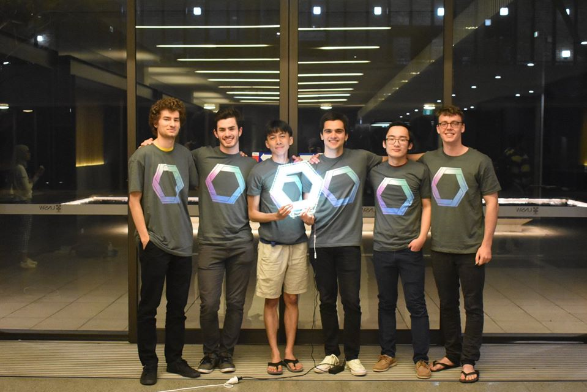

# Pointr

A point/attendance system for colleges - winner of the 2019 UNSW Inter-College Hackathon. Currently hosted on https://pointr.live.

Created by: [Ivan Velickovic](https://github.com/Ivan-Velickovic), [Harrison Steyn](https://github.com/martejj), [JunYang Sim](https://github.com/jysim3), [Oltan Sevic](https://github.com/OltanS), [Steven Shen](https://github.com/StevenShen1999) and [William de Dassel](https://github.com/wdedassel). (From left to right)

## Uses

UNSW Colleges have a point system called room points. The more you do for the colleges the more room points you get and at the end of the year you can apply for a better room. This is currently a massive hassle for the Deans to organise and this software solution aims to alleviate the pressure on them. This also aims to let the Deans and college staff see how people from diverse cultural and linguistic backgrounds are adapting to college life and integrating with the community and whether they need help or not.

## Current Features

* Ability for owner to create 'events'- specifying the name, and the point value of attending the event. 
* Ability for user to attend an event - either by typing an ID and name into event creators laptop or by scanning a QR code.
* Ability for owner to see all people to attend an event and remove or add points to their attendance or remove them altogether.
* Ability for user to see a receipt of all events attended and current point score.
